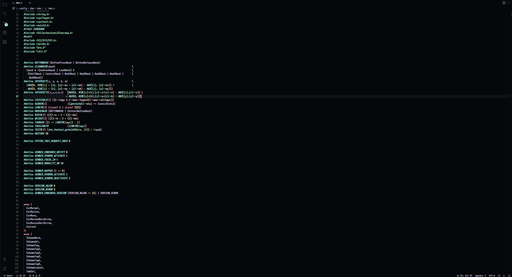

# VSCode
A dark theme for VSCode.

 </br>

## Installation
0. Optional
- [Carbon Product Icons](https://marketplace.visualstudio.com/items?itemName=antfu.icons-carbon)
- [SAGA Heavy](https://github.com/SAGAtheme/SAGAfont/blob/main/ttf/saga-heavy.ttf)

1. Clone this repository into the extension folder:
- VSCode
```
git clone https://github.com/SAGAtheme/VScode.git $HOME/.vscode/extensions/SAGA
```
- VSCodium
```
git clone https://github.com/SAGAtheme/VScode.git $HOME/.vscode-oss/extensions/SAGA
```

### Credit
- [Catppuccin](https://github.com/catppuccin/vscode).